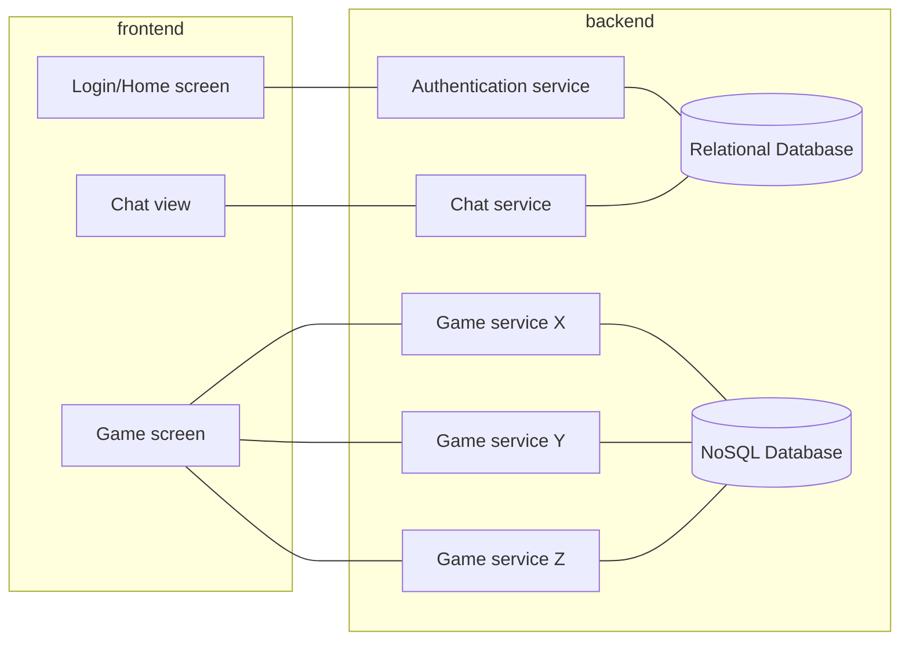

# Stickian Empire - The Architecture

This document holds the key architectural components that the developers of the Stickian Empire game follow. The reading is dense, and the writer is denser, but don't worry, nothing goes over his head, his reflexes are too quick.

Take with a hint of salt any point given as a draft with the status :page_facing_up:.

Work in progress... :warning: :construction_worker:

## Index

1. [High-Level Architecture](#high-level-architecture)
2. [Tools](#tools)
3. [Back-end Architecture](#back-end-architecture)
4. [The NoSQL Approach](#the-nosql-approach)
5. [Real(bothersome)-time problem](#realbothersome-time-problem)
6. ["Micro" Front-ends](#micro-front-ends)
7. [Front-end state management](#front-end-state-management)

## High-Level Architecture

To be able to provide fun to thousands, if millions, of (long distant future) players, a robust and future proof architecture is necessary. This first High-Level approach is to guide the developers and contributors to our final goal.

## Tools

The tools for this project are stated as follows:

- [Go](https://go.dev/) as one of the simplest back-end language with an enourmous power, but a compiled environment to ensure types and no runtime hiccups (yes, I'm looking at you Python 3.x :eyes:).
- [React](https://reactjs.org/) which can be considered as good as any popular front-end framework :poop:, it is MANDATORY to use it with [Typescript](https://www.typescriptlang.org/), forget about classes and go for hooks and functional components.
- (:page_facing_up:) [MongoDB](https://www.mongodb.com/) as the NoSQL approach.
- (:page_facing_up:) [PostegreSQL](https://www.postgresql.org/) as a open source relational database for usage in relational data.

As a developer you should also know that maintaining code readability is always a must, so ensure to have:

- [golangci-lint](https://github.com/golangci/golangci-lint) configured for [Go](https://go.dev/)
- (:page_facing_up:) [Prettier](https://prettier.io/) configured for the rest

## Back-end Architecture

Work in progress... :warning: :construction_worker:

## The NoSQL Approach

Work in progress... :warning: :construction_worker:

## Real(bothersome)-time problem

Work in progress... :warning: :construction_worker:

## "Micro" Front-ends

Work in progress... :warning: :construction_worker:

## Front-end State Management

Work in progress... :warning: :construction_worker:
