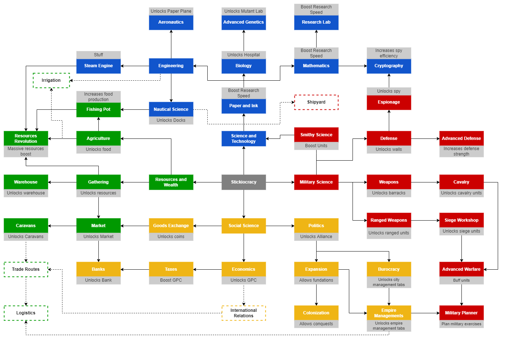

# Technology Tree

The technological tree is subdivided into five main categories, each associated with a color:

1. <ins>**Resources and Wealth**</ins> [green | `#009900` ]: regards all topics on resources production, storage, trade and management;

2. <ins>**Science and Technology**</ins> [blue | `#1155CC` ]: regards to all topics on science and its production, as well as new technology to unlock different assets

3. <ins>**Military Science**</ins> [red | `#CC0000` ]: regards to all topics on military training, development and management;

4. <ins>**Social Science**</ins> [gold | `#F1C232` ]: regards to all topics on social and political development;

5. <ins>**Religion and Spells**</ins> [violet | `#8E7CC3` ]: regards to all religious topics as well as magic spells;

## Technology Tree Overview

Work in progress... :warning: :construction_worker:
