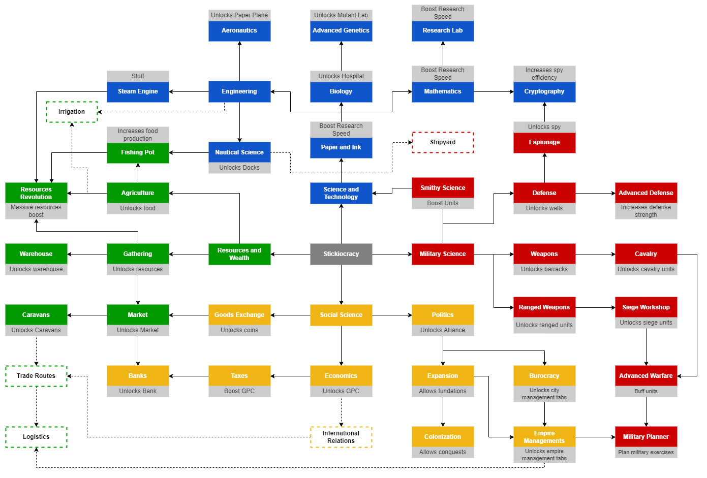

# Technological Tree

The technological tree is subdivided into five main categories, each associated with a color:
1. <ins>**Resources and Wealth**</ins> 
[green | #009900]: regards all topics on resources production, storage, trade and management;

2. <ins>**Science and Technology**</ins> [blue | #1155cc]: regards to all topics on science and its production, as well as new technology to unlock different assets

3. <ins>**Military Science**</ins> [red | #cc0000]: regards to all topics on military training, development

4. <ins>**Social Science**</ins> [yellow | #f1c232]:

5. <ins>**Religion and Spells**</ins> [violet | #8e7cc3]:

